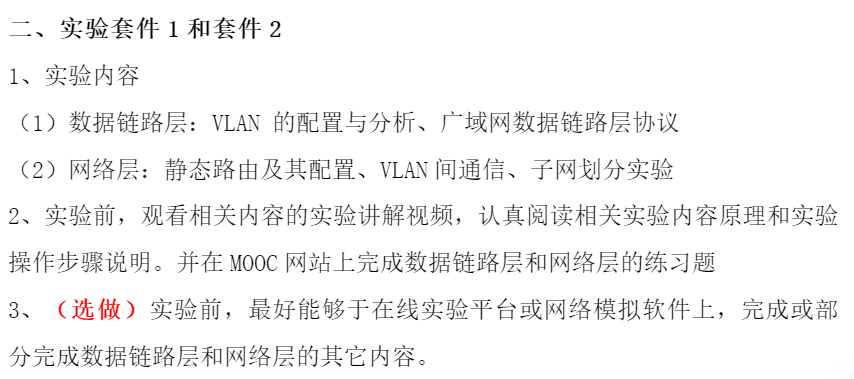

# 计算机网络与通信实验

> 实验套件2

1. 查看[通知](https://docs.qq.com/doc/DVW91VXdCblpwSFFM)了解本周实验任务；
2. 观看对应任务[慕课](https://www.icourse163.org/learn/BUAA-1002744004?tid=1471074494&learnMode=0#/learn/content)视频；
3. [在线实验平台](https://network-lab.mooc.buaa.edu.cn/)进行虚拟实验；
4. 预习[实验报告](./实验报告（研究生）202309.pdf)填写内容；
5. 阅读[电子版实验教材](https://ebook.hep.com.cn/index.html#/reader?bookId=1060860650378493952)查漏补缺；

常见问题[FAQ](https://docs.qq.com/doc/DVXJTdkV1UFJFcWZz)

## 9.19：第一周实验

Tasks:



### VLAN配置与分析

> VLAN(Virtual Local Area Network): 在一个物理网络基础上创建多个逻辑网络，主要目的是增强网络安全性，方便管理数据流。

交换机工作在数据链路层，能够隔离冲突域和广播域，提高带宽实际利用率。

路由器可以连接不同的VLAN。

以太网帧增加的tag字段用于标记属于哪个VLAN，tag帧仅用于交换机间的交流。

不同VLAN属性端口（每个交换机端口只能具有一种属性）

* access：属于一个VLAN（untagged），一般用于连接计算机
* trunk：可以用于收发多个VLAN的报文，只能用于交换机间，只允许默认VLAN报文不打标签（untagged）
* hybrid：二者混合，转发时可以允许多个VLAN报文不打标签

> trunk和hybrid不能只能转换，只能通过access间接转换

H3C默认VLAN 1(pvid)

> MAC地址在数据链路层

==VLAN Trunk & hybrid==

### 广域网数据链路层协议实验

PPP(Point-to-Point Protocol): 广域网中数据链路层点对点通信，能检错不纠错（拨号/宽带上网）

检测到载波 => 链路协商（MTU/认证方式） => 身份认证 => 网络协商 => 通信

身份认证方式：

* PAP：用户名密码明文验证
* CHAP：安全等级较高，被认证方存有认证密钥用于加密，会重复进行

### 路由表分析实验

|Destination/Mask|proto|pref|Metric|Nexthop|Interface|

下一跳默认地址一般是网关

静态路由Static（手动配置），动态路由OSPF/RIP，直连路由Direct

> 动态路由能适应拓扑结构复杂的网络；直连路由不需要手工维护。
>
> pref: preference; Metric: 花费

最长匹配原则

> OSPF
>
> RIP

### VLAN间路由实验

路由器连接不同VLAN

三层交换机：二层交换机和路由器的结合，能实现VLAN间主机通信

一次路由，快速转发映射转发。

> ARP协议
>
> MAC地址解析

```bash
# 清空交换机MAC地址表
undo max-address
# 清空交换机ARP缓存
undo arp <ip>
# 清空计算机ARP缓存命令
arp -d
```

### 子网划分设计实验

IPv4: ABC分别保留8/16/24比特表示网络号；D多播；E保留

为了充分利用IPv4地址，在主机号中又分出了子网号。（子网掩码）

```bash
# 路由表配置静态路由
ip route-static <IP-address> <mask> <nexthop-address>
# 路由表配置默认路由
ip route-static 0.0.0.0 0.0.0.0 <nexthop-address>
```

# 在线实验平台改账号密码

