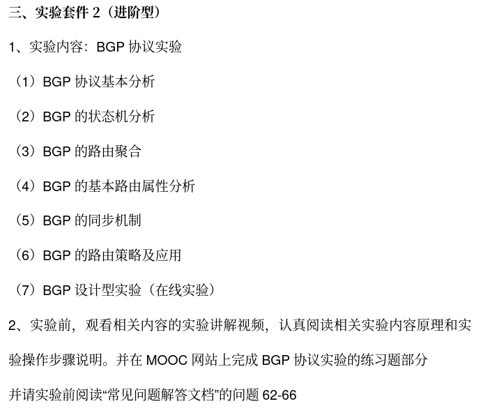
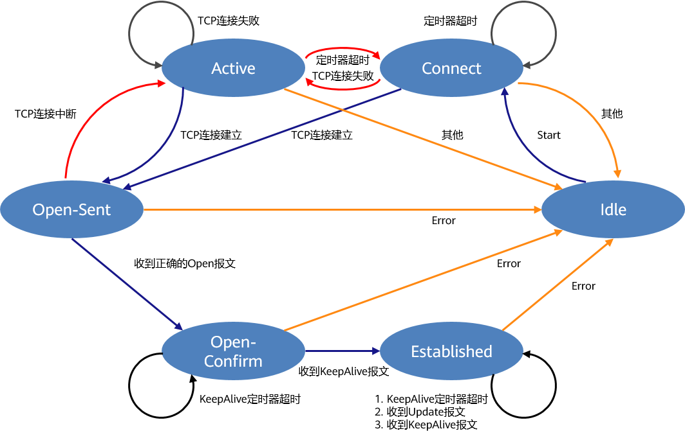

# 计算机网络与通信实验

> 实验套件2

1. 查看[通知](https://docs.qq.com/doc/DVW91VXdCblpwSFFM)了解本周实验任务；
2. 观看对应任务[慕课](https://www.icourse163.org/learn/BUAA-1002744004?tid=1471074494&learnMode=0#/learn/content)视频；
3. [在线实验平台](https://network-lab.mooc.buaa.edu.cn/)进行虚拟实验；
4. 预习[实验报告](./实验报告（研究生）202309.pdf)填写内容；
5. 阅读[电子版实验教材](https://ebook.hep.com.cn/index.html#/reader?bookId=1060860650378493952)查漏补缺；

常见问题[FAQ](https://docs.qq.com/doc/DVXJTdkV1UFJFcWZz)

## 9.19：第三周实验

Tasks:


### VLAN配置与分析

> VLAN(Virtual Local Area Network): 在一个物理网络基础上创建多个逻辑网络，主要目的是增强网络安全性，方便管理数据流。

交换机工作在数据链路层，能够隔离冲突域和广播域，提高带宽实际利用率。

交换机每个冲突域只有一个端口。

路由器可以连接不同的VLAN。

以太网帧增加的tag字段用于标记属于哪个VLAN，tag帧仅用于交换机间的交流。

不同VLAN属性端口（每个交换机端口只能具有一种属性）

* access：属于一个VLAN（untagged），一般用于连接计算机
* trunk：可以用于收发多个VLAN的报文，只能用于交换机间，只允许默认VLAN报文不打标签（untagged）
* hybrid：二者混合，转发时可以允许多个VLAN报文不打标签

> trunk和hybrid不能只能转换，只能通过access间接转换

H3C默认VLAN 1(pvid)

> MAC地址在数据链路层，MAC地址表从源学习

### 广域网数据链路层协议实验

PPP(Point-to-Point Protocol): 广域网中数据链路层点对点通信，能检错不纠错（拨号/宽带上网）

检测到载波 => 链路协商（MTU/认证方式） => 身份认证 => 网络协商 => 通信

身份认证方式：

* PAP：用户名密码明文验证
* CHAP：安全等级较高，被认证方存有认证密钥用于加密，会重复进行

### 路由表分析实验

|Destination/Mask|proto|pref|Metric|Nexthop|Interface|

下一跳默认地址一般是网关

静态路由Static（手动配置），动态路由OSPF/RIP，直连路由Direct

> 动态路由能适应拓扑结构复杂的网络；直连路由不需要手工维护。
>
> pref: preference; Metric: 花费

最长匹配原则

### VLAN间路由实验

路由器连接不同VLAN

三层交换机：二层交换机和路由器的结合，能实现VLAN间主机通信

一次路由，快速转发映射转发。

> ARP协议
>
> MAC地址解析

```bash
# 清空交换机MAC地址表
undo mac-address
# 清空交换机ARP缓存
undo arp <ip>
# 清空计算机ARP缓存命令
arp -d
```

### 子网划分设计实验

IPv4: ABC分别保留8/16/24比特表示网络号；D多播；E保留

为了充分利用IPv4地址，在主机号中又分出了子网号。（子网掩码）

```bash
# 路由表配置静态路由
ip route-static <IP-address> <mask> <nexthop-address>
# 路由表配置默认路由
ip route-static 0.0.0.0 0.0.0.0 <nexthop-address>
```

## 9.26：第四周实验

Tasks:



NAT(Network Address Translation)：用于使内部局域网访问互联网

路由器之间通过串口连接（实验室中已配好）

BGP(Border Gateway Protocol): 边界网关协议，一种去中心化自治路由协议，通常应用在多个AS(Autonomous System, 通常是Internet Service Provider)间，交换AS间无环路可达路由信息。端口号179。支持CIDR。EBGP&IBGP。路由信息中包含AS号码序列

> AS编号是唯一的

Speaker间建立TCP连接，在Peer间交换BGP报文建立BGP会话（BGP-4），四种报文：Open, Update(用于发送路由信息), KeepAlive, Notification(用来发送检测到的差错)

IGP(Internal Gateway Protocol): 内部网关协议，通常是RIP(Routing Information Protocol)或者OSPF(Open Shortest Path First)，在一个路由选择域内的路径最优化问题。

> RIP: 基于UDP报文，端口号520，基于距离向量，每经过一个路由器+1，最大跳数<16（16表示不可达），仅与相邻路由器交换所有信息，每隔30秒更新，收敛过程较快，但网络规模较小。由于不清楚整体网络拓扑，容易产生路由环路。
>
> OSPF: 将AS划分为区域，使用Dijkstra算法



BGP为了减小路由表规模会进行路由聚合。

BGP路由表来源：

1. IGP发现路由（纯动态）
2. 过滤IGP路由再注入（半动态）
3. 静态配置

路由器中先配置对等体组，指定对等体组属于哪个AS，再指定对等体；三层交换机上直接配置对等体。

通过`NETWORK 5.0.0.0 255.0.0.0`注入路由信息

发送Notification报文后会关闭同对等体的连接。

```bash
debug bgp event
terminal debugging
reset bgp all

undo debugging bgp event
display bgp peer [verbose]
display bgp routing-table [peer x.x.x.x advertised-routes/received-routes]
```

> 远程实验插拔连接需要重新提交组网图，时间较长。

```bash
[RTA-bgp]aggregate 172.16.0.0 255.255.240.0 detail-suppressed 
```

BGP路由属性：必遵和可选；过渡（AS间）和非过渡（AS内）

常用属性：

* Origin：描述如何获得路由，0表示内部（聚合/NETWORK），1表示外部，2表示其他（引入路由）
* AS-Path：必遵过渡，确保无环路，优先最短
* Next hop：必遵，略复杂。EBGP下一跳是与对等体连接端口，IBGP不改变下一跳属性，多路共享网络下一跳指向发布路由的路由器
* MED：Multi-Exit-DISC，可选，多入口进入时使用（策略路由），优先选择MED值较小的路由
* Local-Preference：可选，多出口出去时使用，优先选择Local-pref较大的路由
* Community

BGP同步规则：路由器不将从IBGP得到的路由信息通告给EBGP对等体，除非该路由也能够通过IGP得知。

只有当AS系统中IBGP路由器全连接时，才可以取消同步

# 如何捕获交换机间的包：设备间串联Hub接PC机进行截包？

# 如何设置LOOP网段

# 如何设置单独的AS


